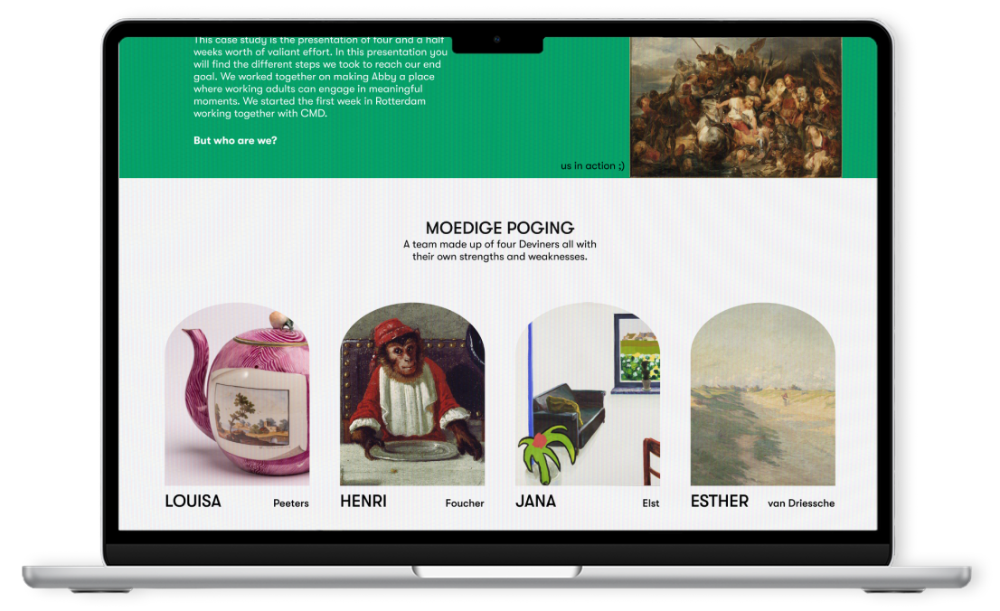
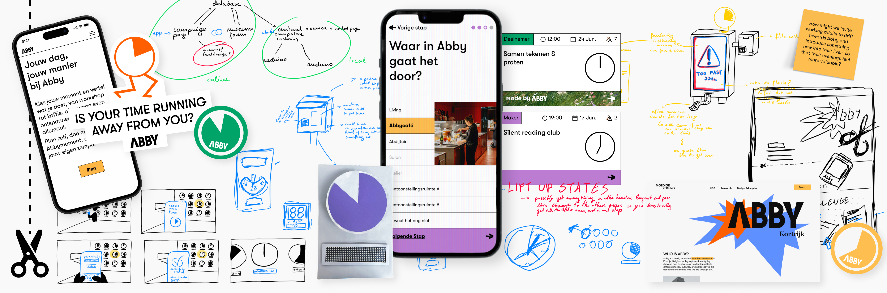
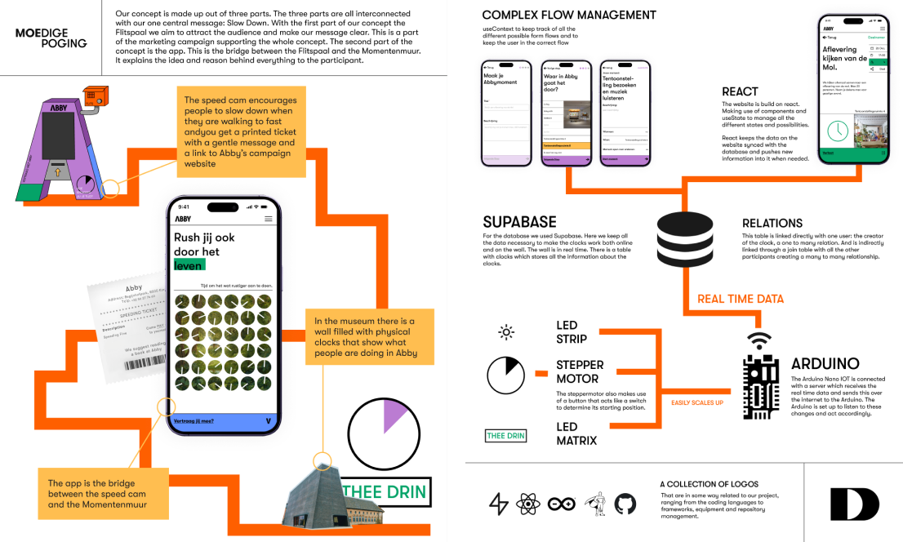
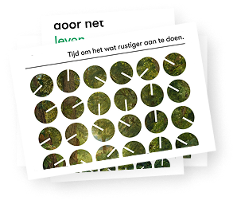
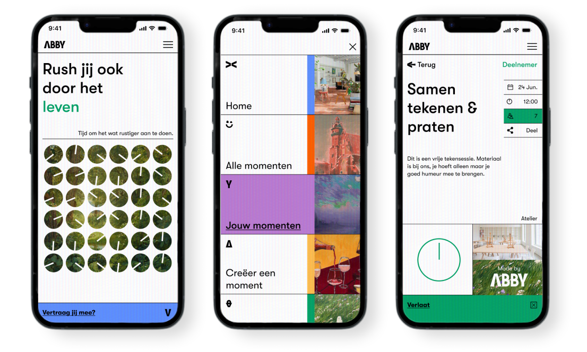

## The brief

Abbymomenten is a comprehensive campaign for Abby, a museum in Kortrijk. It is a group project made for our final integration course. We received the brief from the client and got an extensive explanation of Abby and their vision. The client explained how they are a museum that has recently reopened in Kortrijk after renovations. They wanted to attract new visitor, but mostly they tried to boost participation in activities within their museum.

We pitched two of our ideas to the client, and the client chose the concept they liked the most. After which, we took the client's feedback and expanded on it to fit their wishes. Which is how we got to our idea: De momentenmuur met Abbymomenten. Our campaign asks people to slow down with Abby and encourages small activities to breach the barrier and make bigger activities come easier.

## The process

The ideation phase of the project was <em> a collaborative effort </em> between all of us. It was quite a challenge to balance all of our opinions and end up with one concept everyone was happy with (we’re all quite perfectionist and workaholics). I illustrated our ideas to make sure all of us were on the same page and to explain the concept to the client and our professors. 

We divided the roles at the beginning of the project, but we all helped each other when needed. Which is how I ended up creating many variations for our clock cards on the app. The biggest challenge was visualising the difference between the cards, so you can easily differentiate them from each other. Apart from supporting our lead designer with the app design, I designed our <em> experience design case study website </em> with the content provided by our Lead UXer. 

For development, I supported our Lead developer wherever possible. Together, we decided that React was the right framework for our project, and we hatched out the specifics of our development structure. I researched different databases we could use for keeping our user data and our clock wall information, settling on Supabase. <em> I set up the database and connected it with our website </em> so our Lead developer could focus on other parts. In the end, I also somehow ended up writing a lot of our CSS and putting GSAP into our project. 

Abby - abbymomenten

## The final result

This was one of <em> the most fun projects </em> during my time at Devine. My team members were Wonderfull to work with and together we created something we can all be proud of. We received very positive feedback from both our professors and the client. The process was as fun as seeing others’ reactions to our project. For an overview of the whole process, check out our case study.

