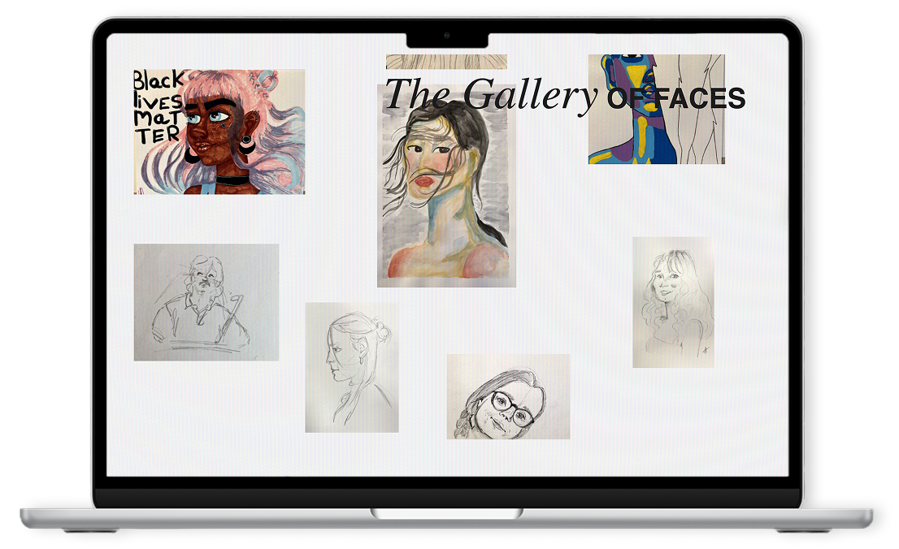
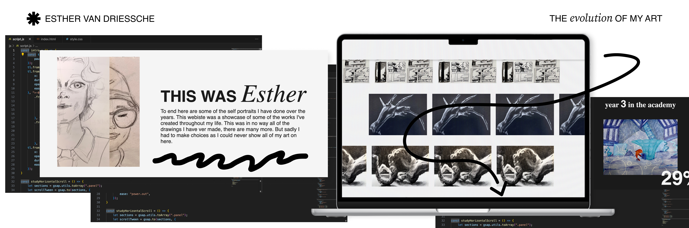
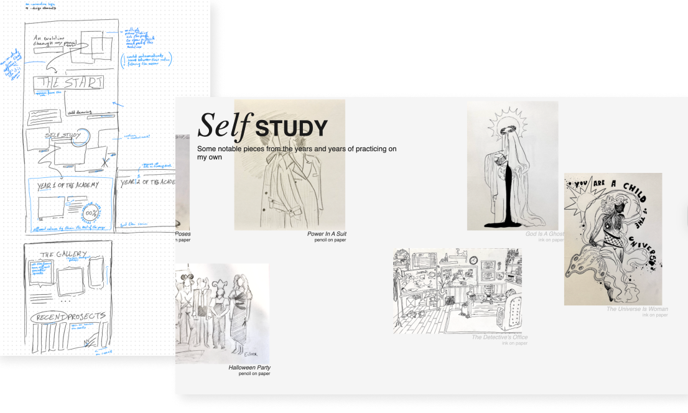
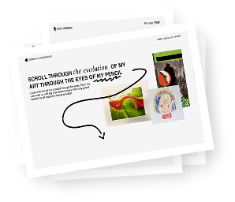
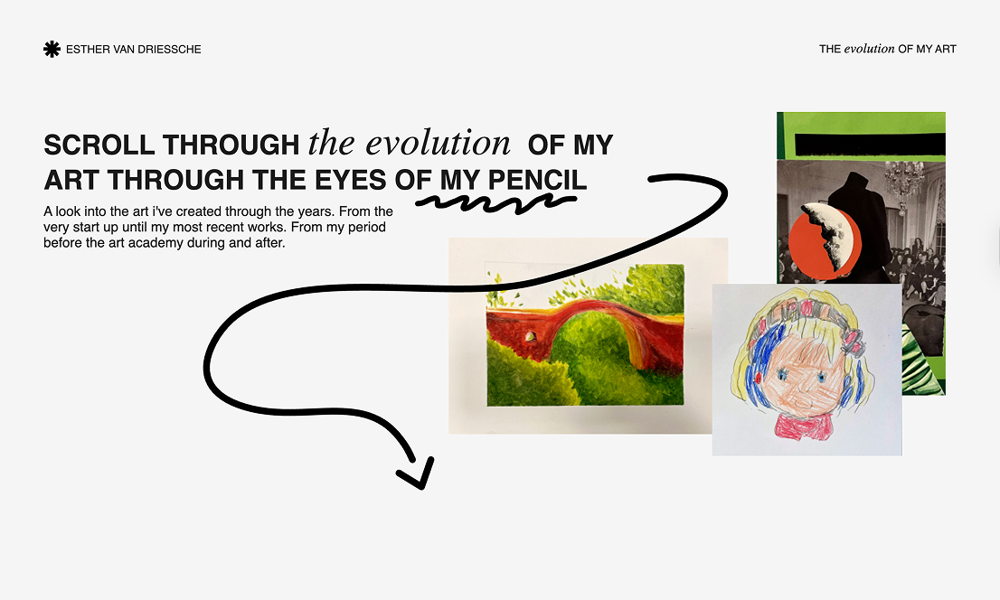

## The brief

For this creative code project, we had to incorporate many different GSAP scrollytelling techniques into a single website. The website tells the story of <em> my evolution in art </em>, going from my very first drawings all the way through to some of the most recent ones (at the time of making, at least). The brief we had was to make it a personal story, and what could be more personal than showing my art?

## The process

The first part was figuring out how I was going to show my art. Chronologically displaying my art throughout the years made sense for the project and the story. Showcasing my evolution in drawing clearly.

Seeing as this is a coding assignment and the design really did not matter to my professors, I had carte blanche. And because I had been wanting to try out this design style for a while, I figured, why not? Bonus points for keeping it simple and focusing on code. 

Gsap, my biggest love, it's CSS in a jacket, but somehow the most fun I’ve ever had with it. While yes, still incredibly frustrating at times, the documentation is bountiful and the community helpful. No matter how much I struggled with placing containers in the wrong spots or using grids where only flex-box is allowed, <em> this project was a joy </em>. Seeing all the amazing examples made by others while scouring the internet for a solution kept me going. 

ART - portfolio

## The final result

No matter how frustrating the process, seeing the result made the tough journey all worth it. Learning how to bring my wildest imagination to life and making my designs move on the web is perhaps the best thing to happen since discovering Figma. CSS made fun, that’s what this project means to me.

