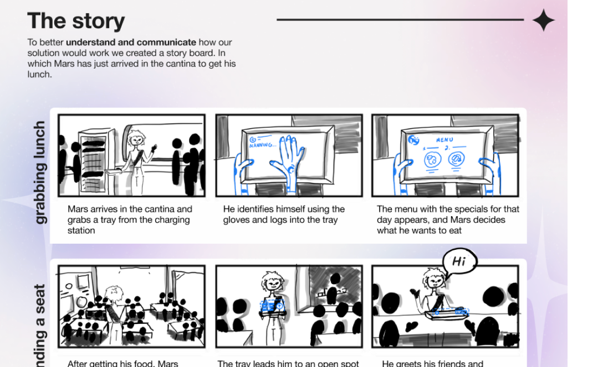
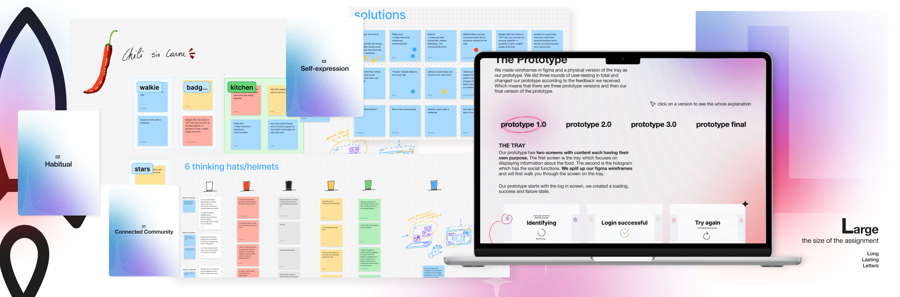
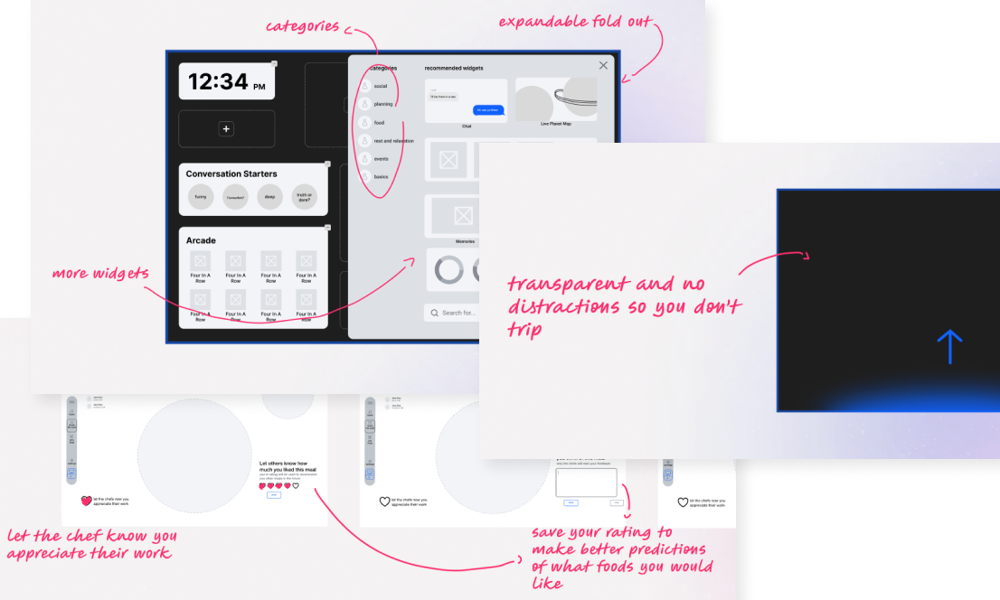
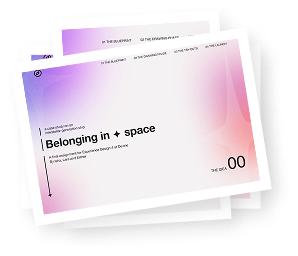
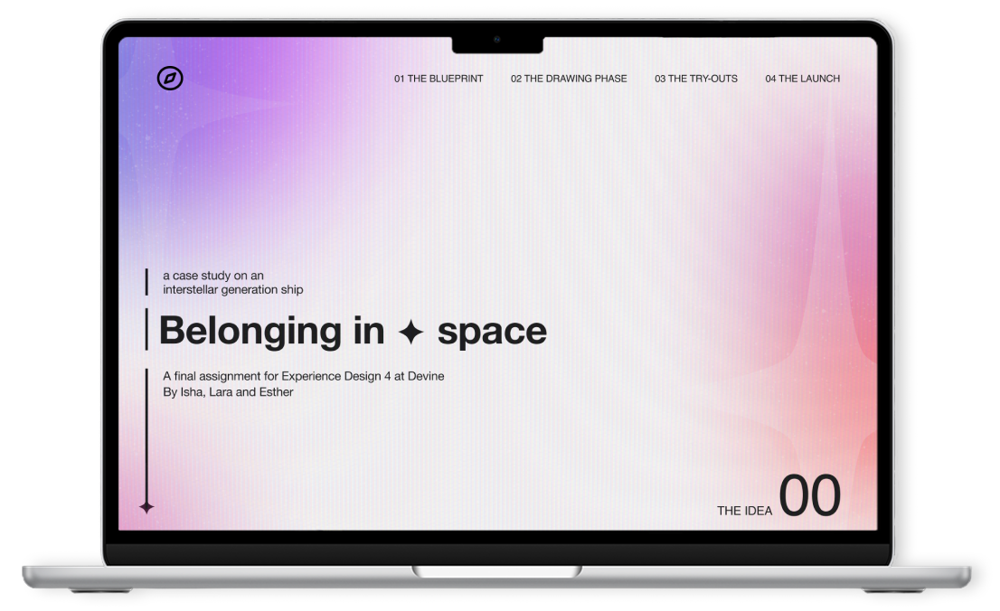

## The brief

Working in a group of three, we made a case study about intergalactic space travel. We first got to choose which specific part of the spaceship we wanted to focus on. Through this, we had to explore all the possibilities and support or work on them through user research. All to design a partly digital solution. The brief was inspired by the Hyperion Design competition of 2025, but adapted to fit the course goals. 

After deciding on our topic, we quickly zeroed in on food as our central theme. <em>Because food connects </em>. We followed the double diamond structure for our project. Over the months of working on this project, we used various techniques learned in class to bring this project to an end.

## The process

The very first step is always doing research, so research, we did. And lots of it. Both desk research and user research were conducted at many different points of this project. Many different UX techniques were utilised to brainstorm ideas, encourage smart decisions and present our solution.

With our solution ready, we started working on making it a reality. Or at least making wireframes. We also tried our hand at making a physical prototype so we could do better user testing than with just our digital frames. Emerging the tester in the spaceship environment was key. Through different rounds of testing, we iterated on our design and presented our hard work in a powerful pitch.  

To showcase what we did from start to finish, we documented everything in our case study website. Wanting to make reading our case study more engaging, we visualised our work, findings and data in a theme fitting for our project. I had a lot of fun thinking of many different ways to make all our content match the space theme. And of course, I also had a lot of fun putting in as many space-related jokes or puns as possible.

Case study - in space

## The final result

The result of our many months of hard work is a stunningly long case study website that walks (or flies) you through our process. Explaining why we made certain decisions and how feedback from user research and testing helped us form our final prototype.

