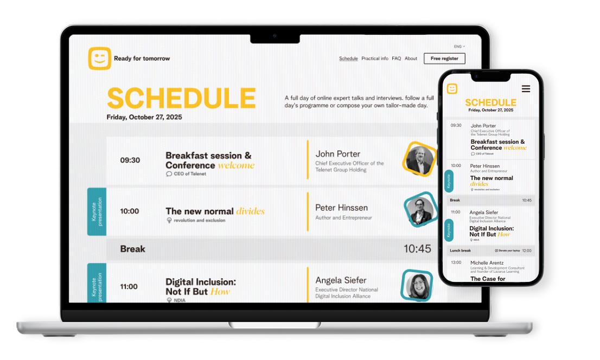
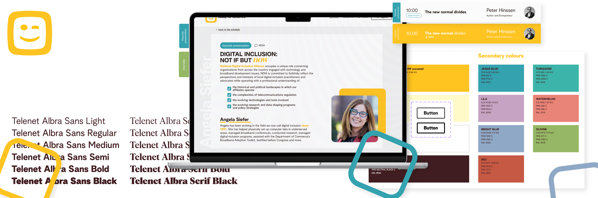
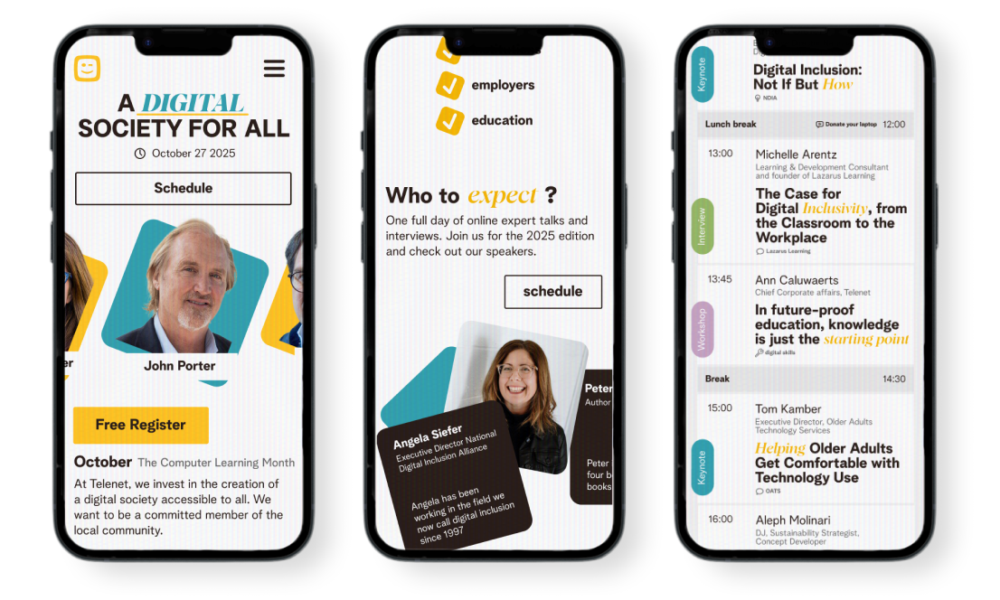
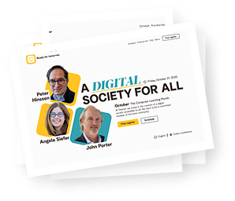
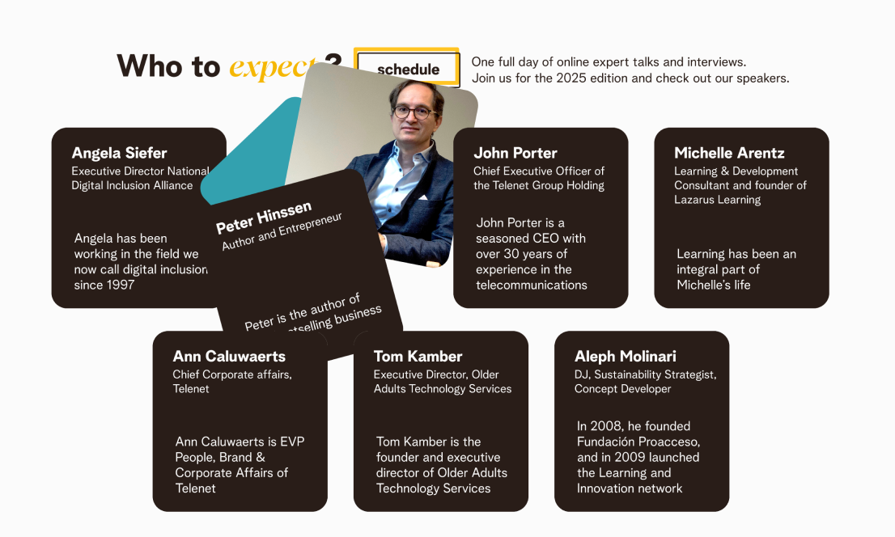

## The brief

<em>A conference website</em> designed for our visual design class. We had to make a website for the Belgian telecommunications company: Telenet. There are no actual relations to the company itself; this project was purely for practising designing a conference website for a brand that has clear brand guidelines. Part of the importance of this assignment is designing the content of a conference website, like a timetable. This content had to look good, but mostly be readable and clear. You want to allow viewers to see the schedule in a clear, efficient way.

This project was a practice in designing different content than we had been doing up until now. It also gave us the new boundaries of working with already existing brand guidelines. This was also the first assignment where we had to design a responsive website by designing the tablet, mobile, and desktop versions.

## The process

Because for this project we had to <em> follow existing brand guidelines </em>, I first familiarised myself with the brand. It was important to understand how the brand worked to be able to create a website that matches the brand. Because the website is for a conference, the assignment asked us not just to follow Telenet’s style but to create a new style. So that was the next step. After creating wireframes for the schedules page, I started designing. 

Many iterations were made, where I played around with the layout, the colouring, the font choices, or the visual language. Decisions were made based on feedback from the professors and on what matched the purpose or branding of Telenet and the conference.

The different versions were made with the devices in mind. The schedule was perhaps the hardest part to design for all the different devices, because they each presented their own challenges. Prototyping the whole website in Figma took quite some time, but in the end, being able to present the whole prototype like a real website made me very proud.

conference - Telenet

## The final result

I liked the challenges of following an existing brand style for the first time a lot. Especially combined with the new problem of designing a schedule where readability and overview are so important. This assignment was a lot of design work to make it a full responsive website, but I still <em> really enjoyed working on this website <em>.

