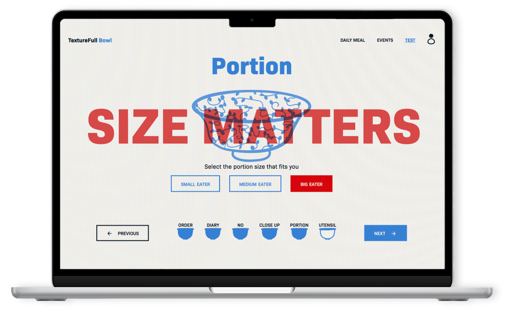
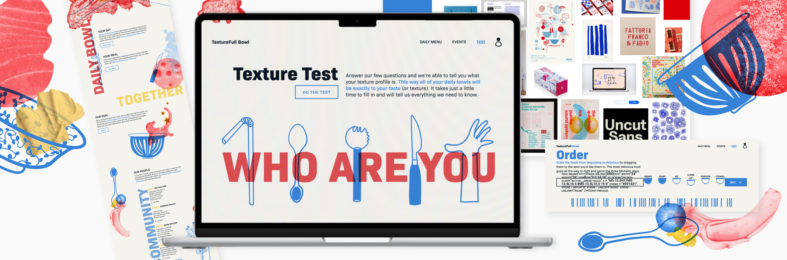
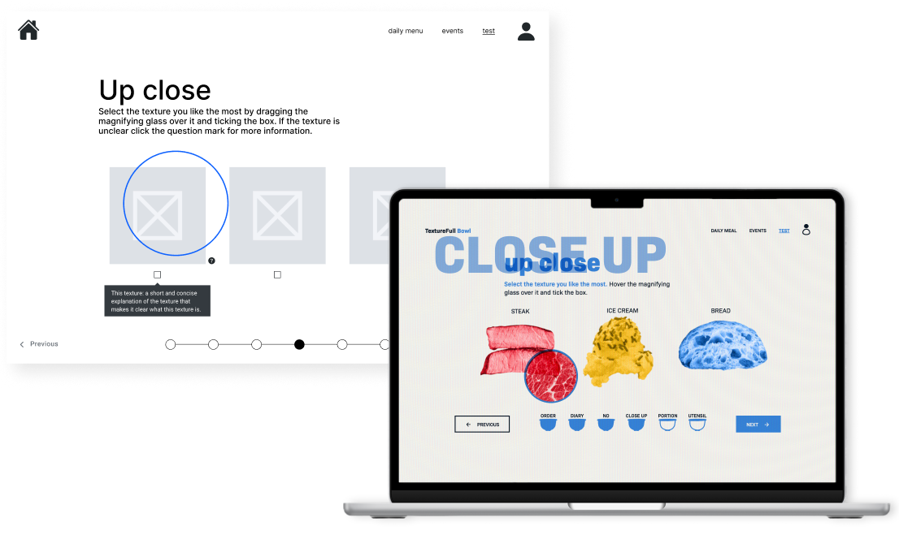
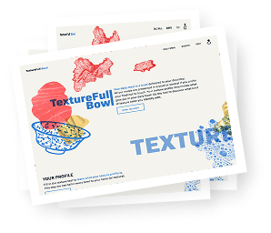
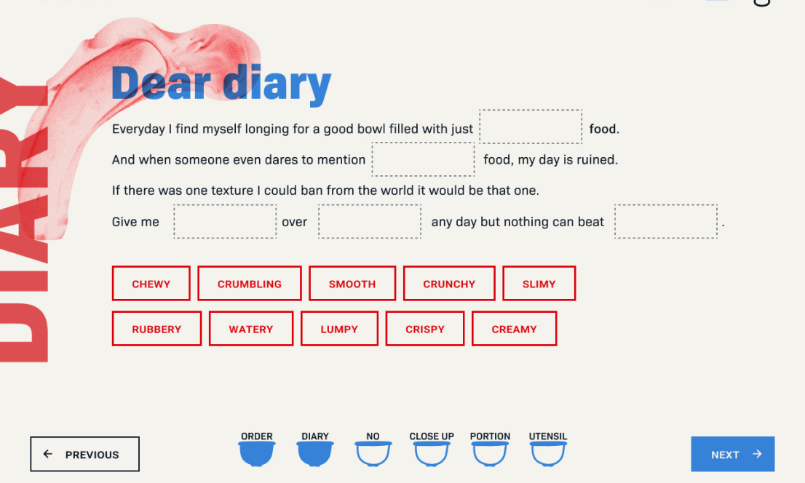

## The brief

We had to create a create a food experience, with a creative concept. I built my website around the idea that for some people,  <em>it’s the texture that makes or breaks the food</em>. Realising that their struggle has gone on for far too long, I decided to create a website. A website that would become the thriving hub for a new community. Our website had to have 5 steps that had a creative twist on the default survey or quiz. 

Technical requirements were a database with data that users could add to. I decided the best way to utilise this for my website would be to add a simple review system to my recipes. This way, users could see the opinions of other fellow texture eaters and know immediately what to expect of the recipe. 

## The process

Figuring out what my website was going to be about wasn’t easy. The brief was vague with few actual content requirements, the ideas were endless, and the expectations even more. Brainstorming was essential; my idea had to be creative and stand out. But mostly the client (=teachers) just needed to not hate it. 

When I thought of visualising my website, I knew I wanted the textures to play an important part. Visualising the textures through using fake, digital, riso graphy inspired close-ups of food images was the way to go. Keeping the theme of the risograph, the colours were decided. However, the bowl also had to play a part. When I thought of the bowls, I thought of porcelain bowls in a grandmother's collection. This became the inspiration for the illustration I decided to use. And so <em> my first website design combining illustrations with images was born, what an experiment this was again. </em>

Technically, there were, of course, the challenges of turning my designs into reality with CSS and somehow making all the impossible ideas for the test come to life. The database part is handled with simple PHP, and the test comes to life through my creative coding skills in JavaScript. 

texure.png

## The final result

After a month of hard work, the end had arrived. A fully functional website was delivered, made entirely from scratch, from idea to execution. The result is a fun, colourful website that is fun to play around with. <em>Discover your texture type by doing the test yourself.</em>

